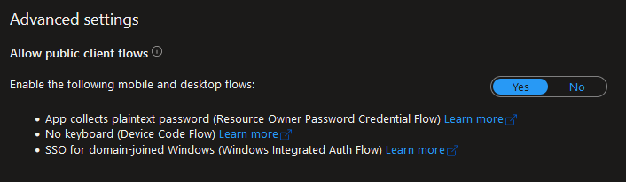
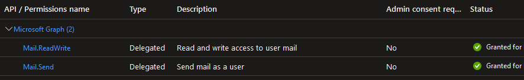

# Frends.Community.Email
Frends task for sending emails. Task sends emails via SMTP protocol and can handle attachments either from file or as raw string input.

[](https://github.com/CommunityHiQ/Frends.Community.Email/actions)

[](https://opensource.org/licenses/MIT)

- [Installing](#installing)
- [Prerequisites for Exchange](#prerequisitesforexchange)
- [Tasks](#tasks)
  - [Send Email](#sendemail)
  - [Send Email To Exchange Server](#sendemailtoexchangeserver)
  - [Read Email With IMAP](#reademailwithimap)
  - [Read Email From Exchange Server](#reademailfromexchangeserver)
- [Building](#building)
- [License](#license)
- [Contributing](#contributing)
- [Change Log](#change-log)

# Installing
You can install the Task via frends UI Task View or you can find the NuGet package from the following NuGet feed
https://www.myget.org/F/frends-community/api/v3/index.json and in Gallery view in MyGet https://www.myget.org/feed/frends-community/package/nuget/Frends.Community.Email

# Prerequisites for Exchange

Due to deprication of legacy authentication to Exchange, tasks related to Exchange are using Microsoft Graph.<br/>
Authentication provider used in Exchange tasks is [Username/password provider](https://docs.microsoft.com/en-us/graph/sdks/choose-authentication-providers?tabs=CS#usernamepassword-provider).<br/>
To use Exchange tasks you need to have a service account which DOES NOT have MFA enabled and an App Registration with following configurations:<br/>

From authentication, Allow public client flows has to be set on, since Resource Owner Password Credentials Flow is a public client flow.<br/>


From API permissions, you need to add delegate permissions for Mail.ReadWrite and Mail.Send from Microsoft Graph. In addition, these permissions need admin consent.<br/>
Without admin consent Graph will require interactive authentication for the user, which is not possible with Frends.<br/>


# Tasks

## SendEmail

### Task Parameters

### Message
Settings for message properties

| Property         | Type   | Description                                         | Example                 |
|------------------|--------|-----------------------------------------------------|-------------------------|
| To               | string | Recipient addresses separated by , or ;.            | jane.doe@somedomain.com |
| Cc               | string | Cc recipient addresses separated by , or ;.         | jane.doe@somedomain.com |
| Bcc              | string | Bcc recipient addresses separated by , or ;.        | jane.doe@somedomain.com |
| From             | string | The email address the message is sent from.         | john.doe@somedomain.com |
| Sender Name      | string | Name of the sender.                                 | Frends errors           |
| Subject          | string | Subject of the message.                             | Hello Jane              |
| Message          | string | Body of the message.                                | You've got mail!        |
| Is message html  | bool   | Indicates whether the mail message body is in Html. | false                   |
| Message encoding | string | Encoding of message body and subject.               | utf-8                   |


### Attachments

Settings for included attachments.

| Property                                | Type                                          | Description                                                                                                                                                                                                                                 | Example         |
|-----------------------------------------|-----------------------------------------------|---------------------------------------------------------------------------------------------------------------------------------------------------------------------------------------------------------------------------------------------|-----------------|
| Attachment type                         | enum { FileAttachment, AttachmentFromString } | Chooses if the attachment file is created from a string or copied from disk.                                                                                                                                                                | FileAttachment  |
| File content                            | string                                        | Usable with Attachment type AttachmentFromString. Sets the content of the attachment file.                                                                                                                                                  | Lorem ipsum...  |
| File name                               | string                                        | Usable with Attachment type AttachmentFromString. Sets the name of the attachment file.                                                                                                                                                     | error.txt       |
| File path                               | string                                        | Usable with Attachment type FileAttachment. Attachment file's path. Uses Directory.GetFiles(string, string) as a pattern matching technique. Exception: If the path ends in a directory, all files in that folder are added as attachments. | C:\\temp\\*.csv |
| Throw exception if attachment not found | bool                                          | Usable with Attachment type FileAttachment. If set true and no files match the given path, an exception is thrown.                                                                                                                          | true            |
| Send if no attachments found            | bool                                          | Usable with Attachment type FileAttachment. If set true and no files match the given path, email will be sent nevertheless.                                                                                                                 | false           |

### SMTP Settings

Settings for connecting to SMTP server.

| Property       | Type   | Description                                                                                                                                                                 | Example                  |
|----------------|--------|-----------------------------------------------------------------------------------------------------------------------------------------------------------------------------|--------------------------|
| Smtp server    | string | SMTP server address.                                                                                                                                                        | smtp.somedomain.com      |
| Port           | int    | SMTP server port.                                                                                                                                                           | 25                       |
| SecureSocket   | enum   | Choose what SecureSocketOptions to use, default: SecureSocketOptions.Auto                                                                                                   | SecureSocketOptions.None |
| AcceptAllCerts | bool   | Accept all certificates when connecting the host, if true, will accept event invalid certificates. If false, will accept self-signed certificates if the root is untrusted. | false                    |
| User name      | string | Use this username to log in to the SMTP server.                                                                                                                             | user                     |
| Password       | string | Use this password to log in to the SMTP server.                                                                                                                             | password                 |


### Result

| Property     | Type   | Description                                   | Example                                                                |
| -------------|--------|-----------------------------------------------|------------------------------------------------------------------------|
| EmailSent    | bool   | Returns true if email message has been sent.  | true                                                                   |
| StatusString | string | Contains information about the task's result. | No attachments found matching path \"C:\\temp\\*.csv\". No email sent. |

## SendEmailToExchangeServer

### Task Parameters

### Message
Settings for message properties

| Property         | Type   | Description                                         | Example                 |
|------------------|--------|-----------------------------------------------------|-------------------------|
| To               | string | Recipient addresses separated by , or ;.            | jane.doe@somedomain.com |
| Cc               | string | Cc recipient addresses separated by , or ;.         | jane.doe@somedomain.com |
| Bcc              | string | Bcc recipient addresses separated by , or ;.        | jane.doe@somedomain.com |
| From             | string | The email address the message is sent from.         | john.doe@somedomain.com |
| Sender Name      | string | Name of the sender.                                 | Frends errors           |
| Subject          | string | Subject of the message.                             | Hello Jane              |
| Message          | string | Body of the message.                                | You've got mail!        |
| Is message html  | bool   | Indicates whether the mail message body is in Html. | false                   |
| Message encoding | string | Encoding of message body and subject.               | utf-8                   |


### Attachments

Settings for included attachments.

| Property                                | Type                                          | Description                                                                                                                                                                                                                                 | Example         |
|-----------------------------------------|-----------------------------------------------|---------------------------------------------------------------------------------------------------------------------------------------------------------------------------------------------------------------------------------------------|-----------------|
| Attachment type                         | enum { FileAttachment, AttachmentFromString } | Chooses if the attachment file is created from a string or copied from disk.                                                                                                                                                                | FileAttachment  |
| File content                            | string                                        | Usable with Attachment type AttachmentFromString. Sets the content of the attachment file.                                                                                                                                                  | Lorem ipsum...  |
| File name                               | string                                        | Usable with Attachment type AttachmentFromString. Sets the name of the attachment file.                                                                                                                                                     | error.txt       |
| File path                               | string                                        | Usable with Attachment type FileAttachment. Attachment file's path. Uses Directory.GetFiles(string, string) as a pattern matching technique. Exception: If the path ends in a directory, all files in that folder are added as attachments. | C:\\temp\\*.csv |
| Throw exception if attachment not found | bool                                          | Usable with Attachment type FileAttachment. If set true and no files match the given path, an exception is thrown.                                                                                                                          | true            |
| Send if no attachments found            | bool                                          | Usable with Attachment type FileAttachment. If set true and no files match the given path, email will be sent nevertheless.                                                                                                                 | false           |

### Exchange Server

Settings for logging in to Exchange using Microsot Graph.

| Property | Type   | Description                                   | Example                            |
|----------|--------|-----------------------------------------------|------------------------------------|
| Username | string | Username of the user who will send the email. | someuser@foobar.com                |
| Password | string | Password of the user who will send the email. | verysecretpassword123              |
| AppId    | string | Application ID of Azure App registration.     | XXXXXXXXX-XXXX-XXXX-XXXX-XXXXXXXXX |
| TenantId | string | Tenant ID of Azure App registration.          | XXXXXXXXX-XXXX-XXXX-XXXX-XXXXXXXXX |

### Result

| Property     | Type   | Description                                   | Example                                                                |
| -------------|--------|-----------------------------------------------|------------------------------------------------------------------------|
| EmailSent    | bool   | Returns true if email message has been sent.  | true                                                                   |
| StatusString | string | Contains information about the task's result. | No attachments found matching path \"C:\\temp\\*.csv\". No email sent. |

## ReadEmailWithIMAP

Read emails using IMAP server.

### Settings for IMAP servers

| Property       | Type   | Description                                                                                                                                                                 | Example         |
|----------------|--------|-----------------------------------------------------------------------------------------------------------------------------------------------------------------------------|-----------------|
| Host           | string | Host address.                                                                                                                                                               | imap.frends.com |
| Port           | int    | Host port.                                                                                                                                                                  | 993             |
| UseSSL         | bool   | Use SSL when connecting host.																																				| true            |
| AcceptAllCerts | bool   | Accept all certificates when connecting the host, if true, will accept event invalid certificates. If false, will accept self-signed certificates if the root is untrusted. | false           |
| UserName       | string | Account name to login with.                                                                                                                                                 | emailUser       |
| Password       | string | Account password.                                                                                                                                                           | ***             |

### Options

| Property            | Type | Description                                        | Example |
|---------------------|------|----------------------------------------------------|---------|
| MaxEmails           | int  | Maximum number of emails to retrieve.              | 10      |
| GetOnlyUnreadEmails | bool | If true, will retrieve only unread emails.         | false   |
| MarkEmailsAsRead    | bool | If true, will mark retrieved emails as read.       | false   |
| DeleteReadEmails    | bool | If true, will delete retrieved emails from server. | false   |

### Result
ReadEmail task returns a list of EmailMessageResult objects. Each object contains following properties:

| Property | Type     | Description            | Example                |
|----------|----------|------------------------|------------------------|
| Id       | string   | Email message id.      | ...                    |
| To       | string   | To field from email.   | agent@frends.com       |
| Cc       | string   | Cc field from email.   | doubleagent@frends.com |
| From     | string   | From field from email. | sender@frends.com      |
| Date     | DateTime | Received date.         | ...                    |
| Subject  | string   | Email subject.         | Important email!       |
| BodyText | string   | Plain text email body. | ...                    |
| BodyHtml | string   | Html email body.       | ...                    |

### Usage
You can loop email message by giving task result as input to foreach-shape:
```sh
#result[ReadEmail]
```

You can reference email properties like so:
```sh
#result[ReadEmail][0].BodyText
```
## ReadEmailFromExchangeServer
Read emails from exchange server with or without attachements.

### ExchangeSettings
Settings for logging in to Exchange using Microsot Graph.

| Property | Type   | Description                                   | Example                            |
|----------|--------|-----------------------------------------------|------------------------------------|
| Username | string | Username of the user who will send the email. | someuser@foobar.com                |
| Password | string | Password of the user who will send the email. | verysecretpassword123              |
| AppId    | string | Application ID of Azure App registration.     | XXXXXXXXX-XXXX-XXXX-XXXX-XXXXXXXXX |
| TenantId | string | Tenant ID of Azure App registration.          | XXXXXXXXX-XXXX-XXXX-XXXX-XXXXXXXXX |
| Mailbox  | string | Mailbox from where the emails are read.       | inbox                              |

### Options

| Property                     | Type   | Description                                                                                          | Example           |
|------------------------------|--------|------------------------------------------------------------------------------------------------------|-------------------|
| MaxEmails                    | int    | Maximum number of emails to retrieve.                                                                | 10                |
| GetOnlyUnreadEmails          | bool   | If true, only attachments of unread emails will be fetched.                                          | false             |
| MarkEmailsAsRead             | bool   | If true, will mark processed emails as read (unless execution is cancelled during processing).       | false             |
| DeleteReadEmails             | bool   | If true, will delete processed emails from server (unless execution is cancelled during processing). | false             |
| EmailSenderFilter            | string | Optional. If a sender is given, it will be used to filter emails.                                    | sender@frends.com |
| EmailSubjectFilter           | string | Optional. If a subject is given, it will be used to filter emails (match as substring).              | Payments          |
| ThrowErrorIfNoMessagesFound  | bool   | If true, error will be thrown if no attachments are found.                                           | false             |
| IgnoreAttachments			   | bool   | If true, attachement handling will be skipped.                                                       | true              |
| GetOnlyEmailsWithAttachments | bool   | If true, gets only emails with attachements.                                                         | true              |
| AttachmentSaveDirectory      | string | Directory where attachments will be saved to.                                                        | C:\WorkDir\       |
| OverwriteAttachment          | bool   | If true, files in the save directory with the sama name as the attachment will be overwritten.       | false             |

### Result
ReadEmailFromExchangeServer task returns a list of EmailMessageResult objects. Each object contains following properties:

| Property           | Type            | Description                      | Example                                                 |
|--------------------|-----------------|----------------------------------|---------------------------------------------------------|
| Id                 | string          | Email message id.                | ...                                                     |
| To                 | string          | To field from email.             | agent@frends.com                                        |
| Cc                 | string          | Cc field from email.             | doubleagent@frends.com                                  |
| Bcc                | string          | Bcc field from email.            | sender@frends.com                                       |
| From               | string          | From field from email.           | sender@frends.com                                       |
| Date               | DateTime        | Received date.                   | ...                                                     |
| Subject            | string          | Email subject.                   | Important email!                                        |
| BodyHtml           | string          | Plain text email body.           | ...                                                     |
| AttachmentSaveDirs | List of strings | Full paths to saved attachments. | {"C:\WorkDir\attchmnt1.txt","C:\WorkDir\attchmnt2.txt"} |

### Usage
You can loop resulting objects by giving task result as input to foreach-shape:
```sh
#result[ReadEmailFromExchangeServer]
```

You can reference result properties like so:
```sh
#result[ReadEmailFromExchangeServer][0].BodyHtml
```

# Building

Clone a copy of the repo.

`git clone https://github.com/CommunityHiQ/Frends.Community.Email.git`

Build the project.

`dotnet build`

Run Tests.

`dotnet test`

Create a NuGet package.

`dotnet pack --configuration Release`

# License

This project is licensed under the MIT License - see the LICENSE file for details.

# Contributing
When contributing to this repository, please first discuss the change you wish to make via issue, email, or any other method with the owners of this repository before making a change.

1. Fork the repo on GitHub
2. Clone the project to your own machine
3. Commit changes to your own branch
4. Push your work back up to your fork
5. Submit a Pull request so that we can review your changes

NOTE: Be sure to merge the latest from "upstream" before making a pull request!

# Change Log

| Version | Changes                                                                                                                                                   |
|---------|-----------------------------------------------------------------------------------------------------------------------------------------------------------|
| 1.0.0   | Initial version of SendEmail.                                                                                                                             |
| 1.1.23  | Added FetchExchangeAttachment.                                                                                                                            |
| 1.2.0   | Tasks no longer use Frends.Task.Attributes.                                                                                                               |
| 1.3.0   | Fixed nuspec and references for build server.                                                                                                             |
| 1.4.0   | ReadEmail can now read attachments. Removed FetchExchangeAttachment.                                                                                      |
| 2.0.0   | Split ReadEmail to ReadEmailWithIMAP and ReadEmailFromExchangeServer. Added IgnoreAttachments and Office356 option.                                       |
| 2.1.0   | Add support for Cc and Bcc recipients to SendEmail task.                                                                                                  |
| 2.2.0   | Ported version for linux agent.                                                                                                                           |
| 2.3.0   | Tighter MAilKit dependency rules.                                                                                                                         |
| 2.4.0   | Now when Windows Authentication is disabled empty credentials are not set and thus frends Agent's credentials are used.                                   |
| 2.5.0   | Changed the EmailTask to use only MailKit and replaced System.Net.Mail SmtpClient to MailKit.Net.Smtp SmtpClient.                                         |
| 2.5.1   | Changed EmailTask to not need credentials and added selector for SecureSocketOptions and removed UseSsl bool attribute                                    |
| 2.5.2   | Fixed bug in SendEmail task. Now email message can contain curly brackets.                                                                                |
| 2.6.0   | Added new task for sending email to Exchange server. Added possibility to use access token as authentication method for ReadEmailFromExchangeServer-task. |
| 3.0.0   | ReadEmailFromExchangeServer modified to use Microsoft Graph. Added task for sending emails to Exchange server. Basic authentication removed from ReadEmailFromExchangeServer-task, which breaks the version 2.6.0 implementation. Migration from Basic authentication to OAuth is necessary when updating to 3.0.0. |
